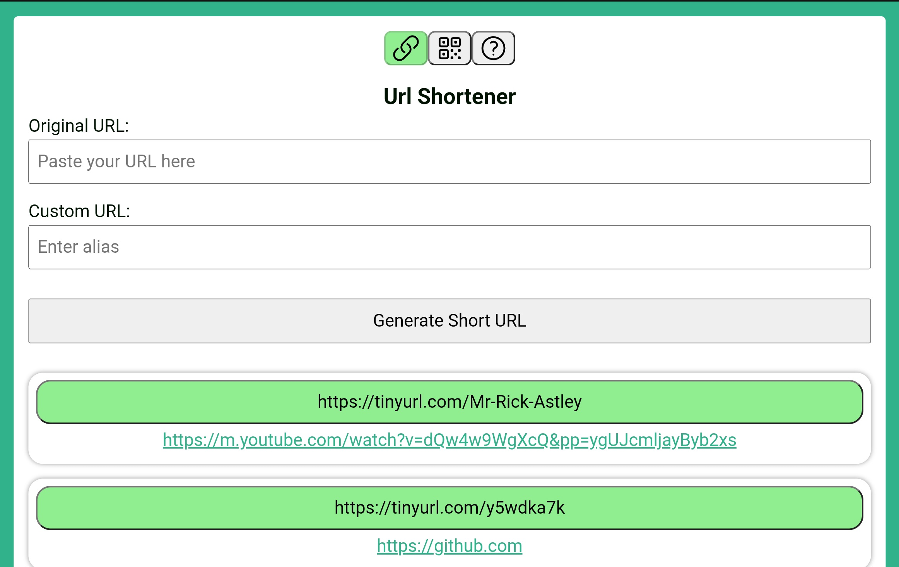
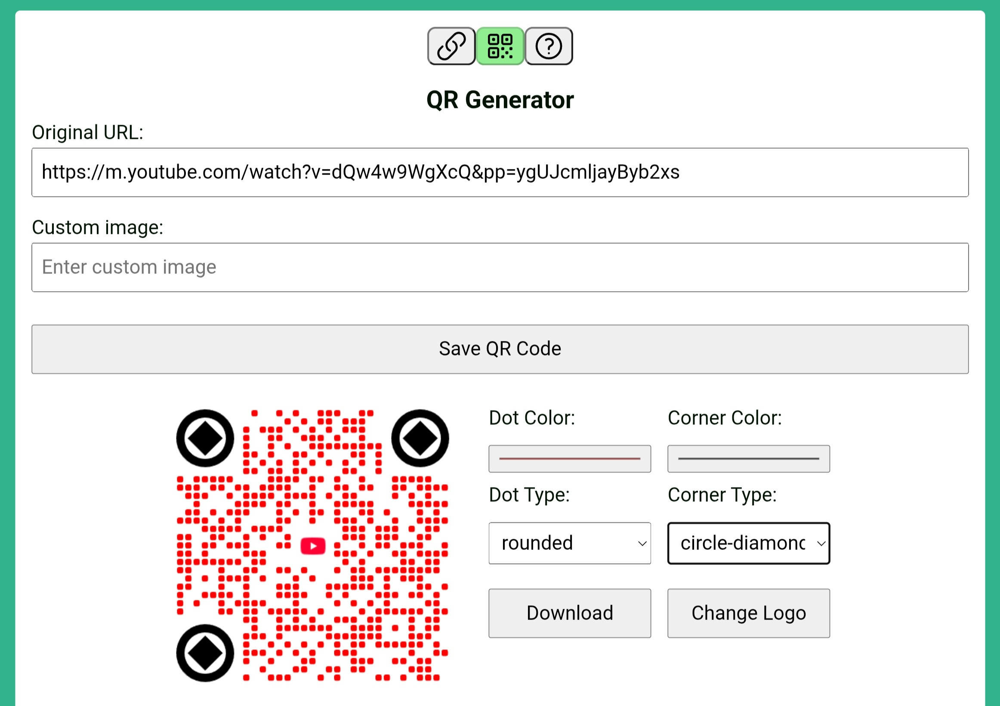
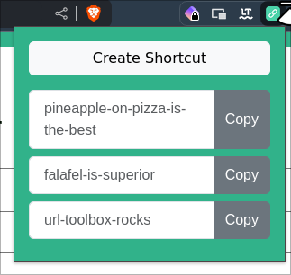

<div align="center">

## Url Toolbox

</div>

<div align="center">
  <table>
    <tr>
      <td>
        
      </td>
      <td>
        
      </td>
    </tr>
  </table>
</div>

## Overview

Url Toolbox is a web application that helps users with their URLs in various ways.

Our application has two main tools:

- URL Shortener: Shorten the length of their URLs. Users can also customize the shortened link with their own alias, making the link more personal and easier to remember.
- QR Generator: Generate unique QR codes with its own color and logo.

The application is built with Vue 3, which enables a component-based architecture. It is responsive, making it usable on mobile devices, tablets, and desktops.

The application uses LocalStorage to save previously shortened links locally in the browser. This keeps the application as simple as possible, since no account is needed to use the service.

---

### Chrome Extension

There is also a Chrome extension available for Url Toolbox, providing quick access to the URL Shortener and QR Generator tools directly from your browser toolbar.

<div align="center">
  <table>
    <tr>
      <td>
        
      </td>
    </tr>
  </table>
</div>

---

### Technologies used

#### Frontend

| Name                             | Description                                    |
| -------------------------------- | ---------------------------------------------- |
| [Vue 3](https://vuejs.org/)      | Frontend javascript framework for building UIs |
| [Vite](https://vite.dev/)        | Build tool                                     |
| [eslint](https://eslint.org/)    | Static code analyzer                           |
| [prettier](https://prettier.io/) | Code formatter                                 |

#### Api

| Name                                   | Description                                                                  |
| -------------------------------------- | ---------------------------------------------------------------------------- |
| [Tinyurl](https://tinyurl.com/app/dev) | Shorten long URLS into TinyURLs                                              |
| [corsproxy.io](https://corsproxy.io/)  | Bypasses browser CORS restrictions to securely access cross-domain resources |

#### Libraries

| Name                                                               | Description                     |
| ------------------------------------------------------------------ | ------------------------------- |
| [qrcode-with-logos](https://zxpsuper.github.io/qrcode-with-logos/) | Library for generating QR codes |

#### Standards

| Name                                                   | Description                             |
| ------------------------------------------------------ | --------------------------------------- |
| [Semantic Versioning](https://semver.org/)             | Versioning scheme for software releases |
| [Conventional Commits](https://tinyurl.com/cchellyeah) | Naming convention for commit messages   |

## Framework comparisons

### Vue vs React

Vue uses HTML templating to integrate JavaScript into HTML. Vue is similar to traditional web development, where CSS, HTML, and JavaScript are separated. React, on the other hand, uses JavaScript Expressions (JSX) to include HTML within JavaScript files. Both Vue and React have components with a lifecycle that allows the application to re-render only the parts that need to be updated when a component changes. It can, however, be argued that Vue does this in an easier way.

React is actually not a framework, even though many refer to it as such. React is a library, unlike Vue, which is a complete framework. This means that React itself does not provide everything you need to build a full application, such as routing and state management. These require external libraries to be added. Vue, on the other hand, includes all the necessary features, and no external libraries are needed unless you want to build more complex functionality.

We chose Vue as the framework instead of React, primarily because we had significantly less experience with Vue and wanted to learn a new framework, but also because it is easier to use when building a smaller application.

Source: https://hackr.io/blog/react-vs-vue

### Vue vs Angular

Angular is a JavaScript framework maintained by Google. It is an older but proven framework based on the Model View Controller (MVC) pattern, with projects written in TypeScript. Angular has several built-in features. For example, it includes a router for building single-page applications (SPA). Another feature is the built-in testing framework Jasmine. With this testing framework, one can create unit and integration tests for the application. In light of this, Angular can be considered a good choice for larger projects where testing and adherence to various requirements are important.

Vue, compared to Angular, has less built-in functionality and relies more on adding external modules to increase functionality, which Angular largely includes out of the box. However, these features and the MVC pattern in Angular contribute to greater overhead compared to Vue. Additionally, the learning curve is steeper with Angular, as it has more of its own syntax, whereas Vue stays closer to HTML, CSS, and JavaScript with its use of templates. Since this is a smaller project, we do not need the many features that Angular provides. Therefore, we believe that choosing Vue is more advantageous. This is because Vue offers a simpler syntax, a smaller learning curve, and a program size that is not as large as Angular.

Source: https://www.orientsoftware.com/blog/angular-vs-vue/

## Project Setup

### Prerequisites

- [Git](https://git-scm.com) version >= 2.13
- [Node.js](https://nodejs.org) version >= 22

```sh
npm install
```

### Compile and Hot-Reload for Development

```sh
npm run dev
```

### Type-Check, Compile and Minify for Production

```sh
npm run build
```

### Lint with [ESLint](https://eslint.org/)

```sh
npm run lint
```

## Type Support for `.vue` Imports in TS

TypeScript cannot handle type information for `.vue` imports by default, so we replace the `tsc` CLI with `vue-tsc` for type checking. In editors, we need [Volar](https://marketplace.visualstudio.com/items?itemName=Vue.volar) to make the TypeScript language service aware of `.vue` types.

### Customize configuration

See [Vite Configuration Reference](https://vite.dev/config/).
